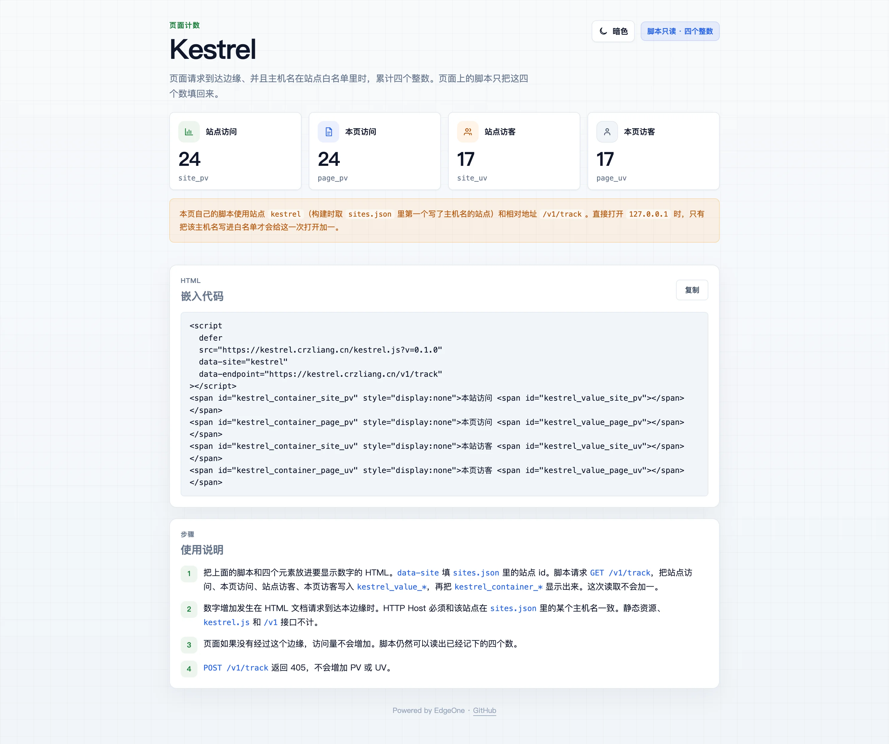
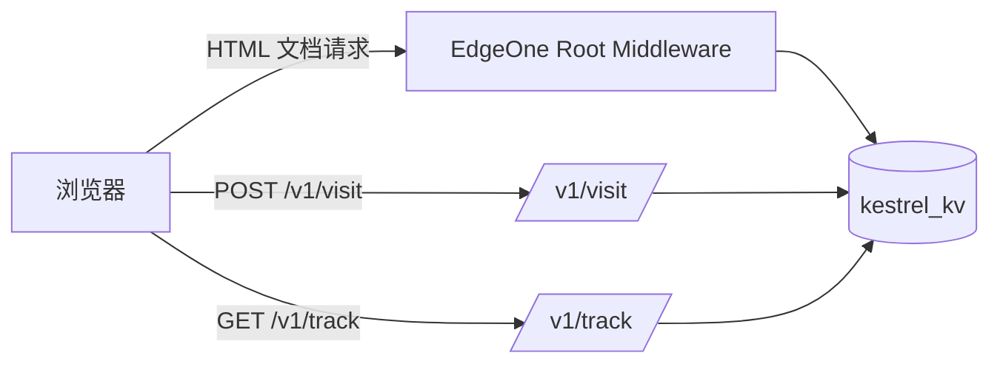

<h1 align="center">Kestrel</h1>

<p align="center">轻量、白名单、隐私优先的 EdgeOne 页面计数。</p>

<p align="center">
  <a href="https://edgeone.ai/pages/new?repository-url=https%3A%2F%2Fgithub.com%2Fcrzliang%2FKestrel"></a>
  <a href="https://github.com/crzliang/Kestrel"></a>
  
  
  <a href="https://edgeone.ai/document/173005746529800192"></a>
</p>

<p align="center">
  
</p>

Kestrel 把站点 PV、页面 PV、站点 UV、页面 UV 四个整数放在腾讯云 EdgeOne 上累计。托管在 Kestrel EdgeOne 项目里的站点由根目录 middleware 在文档请求上计数；托管在其他 Pages 项目（Astro、Vite 等）的站点通过 `POST /v1/visit` 上报。页面脚本只读取四个整数，不采集原始事件、明文 IP、来源或设备信息。

<p align="center">
  
  
  
  
</p>

---

## 目录

- [为什么是 Kestrel](#为什么是-kestrel)
- [工作原理](#工作原理)
- [接入方式](#接入方式)
- [快速开始](#快速开始)
- [站点配置](#站点配置)
- [嵌入与上报](#嵌入与上报)
- [API](#api)
- [EdgeOne 部署](#edgeone-部署)
- [项目结构](#项目结构)
- [文档](#文档)
- [贡献](#贡献)
- [Contributors](#contributors)

---

## 为什么是 Kestrel

- **轻量** — `kestrel.js` gzip 后小于 5KB，只把四个整数填回页面。
- **白名单** — 写入和读取都要求 `Origin` / `Referer` 命中 `sites.json` 中该站点的域名。
- **隐私优先** — 只存四个计数和 UV 去重标记，不存原始事件、明文 IP、来源或设备。
- **边缘原生** — 根目录 middleware、Edge Functions 和 KV 全部运行在 EdgeOne，无需自备应用服务器。
- **多站点** — 一个 KV 命名空间服务多个站点，用 `site_id` 隔离计数。

---

## 工作原理



- **middleware 计数**：适合直接接入 Kestrel EdgeOne 项目的站点。文档请求到达边缘且 Host 命中白名单时记一次。
- **客户端上报**：适合托管在其他 Pages 项目的静态站点。页面通过 `POST /v1/visit` 上报，接口按 `Origin` 校验站点白名单。
- **只读展示**：页面通过 `GET /v1/track` 读取四个整数，读取不会增加 PV。

---

## 接入方式

| 场景 | 计数入口 | 读取接口 |
| --- | --- | --- |
| 站点由 Kestrel EdgeOne 项目托管 | 根目录 `middleware.ts` 自动计数 | `GET /v1/track` |
| 站点托管在其他 Pages 项目 | 页面脚本调用 `POST /v1/visit` | `GET /v1/track` |

两种方式都要求站点主机名写在 `sites.json` 的 `domain` 里。读取接口同样校验来源，白名单之外返回 `403 forbidden_origin`。

---

## 快速开始

**要求：** Node.js ≥ 18

```bash
npm install
npm run build -w @kestrel/shared
npm run build:tracker
npm run dev
```

本地 Mock 服务：

```text
http://127.0.0.1:8088/
```

它读取同一份 `sites.json`，对非 `/v1` 的 HTML 文档请求按 `Host` 计数，并从 `tracking-script/dist` 提供 `kestrel.js`。计数落在 `.kestrel/mock/counts.json`（已 gitignore）。

验证一次计数：

```bash
curl -sD - -o /dev/null \
  -H 'Host: kestrel.crzliang.cn' \
  -H 'Accept: text/html' \
  http://127.0.0.1:8088/

curl -s 'http://127.0.0.1:8088/v1/track?siteId=kestrel&path=/'
```

其他命令：

```bash
npm test            # 计数规则、白名单、首页产物、脚本体积
npm run typecheck   # 全仓类型检查
npm run dev:tracker # 监听并重建 kestrel.js
npm run test:ci     # 构建 + 类型检查 + 冒烟测试
```

---

## 站点配置

站点和域名白名单写在仓库根目录的 `sites.json`，随代码提交。

```json
{
  "sites": [
    { "id": "kestrel", "domain": ["kestrel.crzliang.cn"] },
    { "id": "www", "domain": ["www.crzliang.cn"] },
    { "id": "blog", "domain": ["blog.crzliang.cn"] }
  ]
}
```

| 字段 | 含义 |
| --- | --- |
| `id` | 站点 ID。2–64 位，仅字母、数字、下划线，比较时忽略大小写 |
| `domain` | 主机名白名单。不要写协议、路径、端口或 `*.example.com`；空数组表示该站点不计数 |

Host 比较忽略大小写、去掉末尾的点，端口不参与，只做精确匹配。多个站点写同一个主机名时，`sites.json` 里先出现的站点生效。

改完 `sites.json` 后重新部署。文件不合法（重复 id、通配符、带端口的主机名）时，函数会在启动时失败。

---

## 嵌入与上报

### 只读展示

```html
<script
  defer
  src="https://kestrel.crzliang.cn/kestrel.js?v=0.1.0"
  data-site="YOUR_SITE_ID"
  data-endpoint="https://kestrel.crzliang.cn/v1/track"
></script>
<span id="kestrel_container_site_pv" style="display:none">本站访问 <span id="kestrel_value_site_pv"></span></span>
<span id="kestrel_container_site_uv" style="display:none">本站访客 <span id="kestrel_value_site_uv"></span></span>
<span id="kestrel_container_page_pv" style="display:none">本页访问 <span id="kestrel_value_page_pv"></span></span>
<span id="kestrel_container_page_uv" style="display:none">本页访客 <span id="kestrel_value_page_uv"></span></span>
```

`kestrel.js` 只调用 `GET /v1/track`，不会增加 PV/UV。

### 外部站点上报

页面不经过 Kestrel middleware 时，需要额外调用一次写入接口。最小示例：

```html
<script>
  (function () {
    var url = new URL('https://kestrel.crzliang.cn/v1/visit');
    var key = 'kestrel_visitor_id';
    var id = localStorage.getItem(key);
    if (!id) {
      id = (crypto.randomUUID ? crypto.randomUUID() : String(Date.now()) + Math.random()).replace(/-/g, '');
      localStorage.setItem(key, id);
    }
    url.searchParams.set('siteId', 'YOUR_SITE_ID');
    url.searchParams.set('path', location.pathname + location.search);
    url.searchParams.set('visitorId', id);
    fetch(url, { method: 'POST', credentials: 'omit' })
      .then(function (res) { return res.ok ? res.json() : null; })
      .then(function (counts) {
        if (!counts) return;
        ['site_pv', 'page_pv', 'site_uv', 'page_uv'].forEach(function (name) {
          var value = document.getElementById('kestrel_value_' + name);
          if (value) value.textContent = counts[name];
          var box = document.getElementById('kestrel_container_' + name);
          if (box) box.style.display = 'inline';
        });
      });
  })();
</script>
```

写入接口会校验 `Origin` / `Referer`。只有站点白名单里的域名可以上报。

---

## API

| 方法 | 路径 | 说明 |
| --- | --- | --- |
| `GET` | `/v1/track` | 只读四个整数。来源必须命中站点白名单；不增加 PV |
| `POST` | `/v1/visit` | 记录一次访问。来源必须命中站点白名单；返回四个整数和 `visitorId` |
| `POST` | `/v1/track` | 明确不计数，返回 `405 not_counted` |

`GET /v1/track` 返回：

```json
{ "site_pv": 2, "page_pv": 2, "site_uv": 1, "page_uv": 1 }
```

错误码：

| 错误 | 状态码 | 含义 |
| --- | --- | --- |
| `siteId_required` | `400` | 缺少 `siteId` |
| `invalid_payload` | `400` | 参数格式不合法 |
| `forbidden_origin` | `403` | 来源不在该站点白名单里 |
| `unknown_site` | `404` | `siteId` 不在 `sites.json` 中 |

---

## EdgeOne 部署

### 存储

在 EdgeOne KV 创建命名空间，并绑定到 Pages 项目：

```text
变量名称：kestrel_kv
```

站点名单 `sites.json` 不写入 KV。未绑定 KV 时函数会回落到进程内 Map，仅便于联调，数据不会持久化。

### 构建设置

`edgeone.json` 会覆盖控制台里的构建配置；用 Git 导入时以仓库文件为准。

| 项 | 填写 |
| --- | --- |
| 框架预设 | `Other` |
| 根目录 | `./` |
| 输出目录 | `tracking-script/dist` |
| 构建命令 | `npm run build` |
| 安装命令 | `npm install` |

### 发布

```bash
npm run build
npm i -g edgeone
edgeone pages deploy
```

`middleware.ts` 和 `edge-functions/` 由 EdgeOne 按源码部署，不在静态输出目录里。首页由 `edge-functions/index.ts` 输出，并带 `Cache-Control: private, no-store`。不要把 `index.html` 放进输出目录，否则静态 HTML 可能命中 CDN 缓存并跳过 middleware。发布后如果首页仍返回 `EO-Cache-Status: Cache Hit`，在控制台清一次该主机名的缓存。

也可以使用官方部署按钮：

[](https://edgeone.ai/pages/new?repository-url=https%3A%2F%2Fgithub.com%2Fcrzliang%2FKestrel)

---

## 项目结构

```text
Kestrel/
├── middleware.ts                 # 文档请求按 Host 计数
├── sites.json                    # 站点 id 与域名白名单
├── edge-functions/
│   ├── index.ts                  # 首页 HTML
│   ├── v1/track.ts               # 只读计数
│   ├── v1/visit.ts               # 客户端上报计数
│   └── lib/                      # 计数、KV、来源校验、访客标识
├── packages/shared/              # 共享类型与校验
├── tracking-script/              # 埋点脚本 → dist/kestrel.js
├── scripts/                      # 本地 Mock 与冒烟测试
└── docs/                         # 技术文档
```

---

## 文档

| 文档 | 内容 |
| --- | --- |
| [技术蓝图](./docs/TECHNICAL.md) | 架构与接口 |
| [追踪与存储](./docs/TRACKING-AND-STORAGE.md) | 脚本缓存、KV 计数键 |
| [EdgeOne 部署按钮](https://edgeone.ai/document/173005746529800192) | 官方部署按钮说明 |

---

## 贡献

欢迎提交 Issue 或 Pull Request。提交前请先运行：

```bash
npm run test:ci
```

## Contributors

<a href="https://github.com/crzliang/Kestrel/graphs/contributors">
  
</a>

<p align="center"><a href="#kestrel">回到顶部</a></p>
