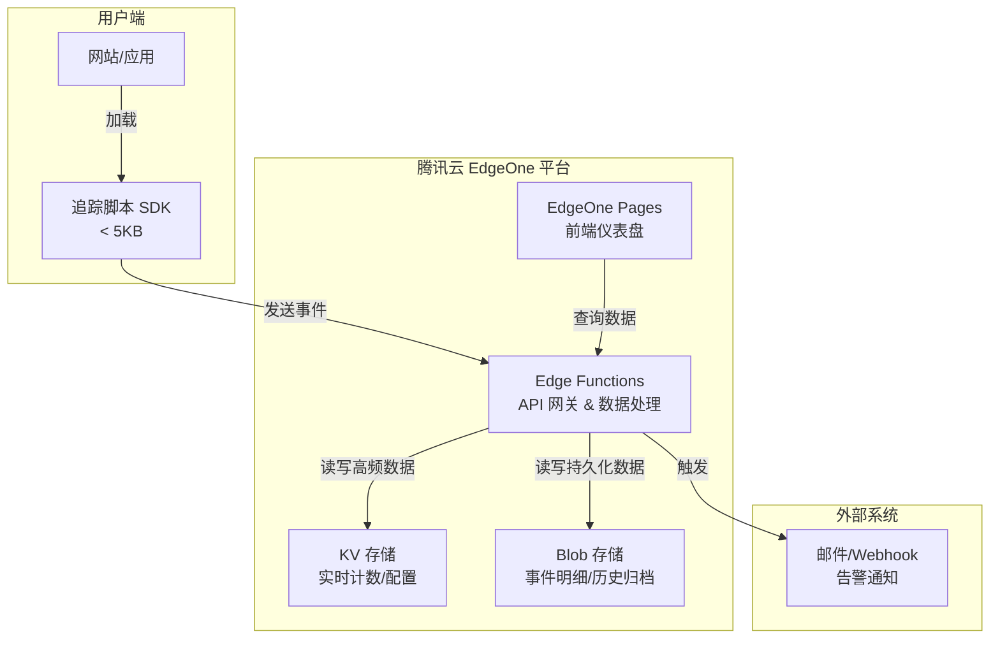

# 项目技术文档：Kestrel Analytics

> 一个基于腾讯云 EdgeOne 构建的轻量级、实时网站分析工具。

## 1. 项目概述

**Kestrel Analytics** 是一款面向现代 Web 的隐私友好型网站分析工具。它旨在提供**实时、轻量、可自托管**的访客行为洞察。

### 核心目标

- **实时性**：利用边缘计算能力，实现数据秒级采集与展示。
- **轻量级**：前端追踪脚本 < 5KB，对网站性能几乎无影响。
- **隐私优先**：默认不收集个人可识别信息（PII），符合 GDPR 要求。
- **云原生**：完全基于腾讯云 EdgeOne 生态，无需维护服务器。

### 主要功能（MVP 阶段）

1. **实时仪表盘**：展示当前在线人数、今日 PV/UV。
2. **流量概览**：按时间维度（小时/天/周）展示访问趋势。
3. **来源分析**：识别访客来源渠道（直接/搜索引擎/外链）。
4. **页面分析**：查看各页面浏览量及用户停留时长。
5. **设备分析**：统计操作系统、浏览器及设备类型分布。
6. **地图浏览**：按国家展示今日访客分布（仅国家码，不存 IP；EdgeOne `request.eo.geo`）。

## 2. 技术架构

### 2.1 整体架构图



### 2.2 数据流说明

1. **采集端**：网站嵌入追踪脚本，用户访问时触发，发送事件数据至 EdgeOne 边缘节点。
2. **处理端**：Edge Functions 接收事件，完成数据清洗、增强（如解析 User-Agent 获取设备信息），并执行预聚合逻辑。
3. **存储端**：
   - 实时计数（如当前在线、PV）写入 **KV**（最终一致性，高性能）。
   - 原始事件明细及聚合后的历史数据写入 **Blob**（强一致性，持久化）。
4. **展示端**：仪表盘前端通过 API 从 KV（实时数据）和 Blob（历史数据）读取并可视化。

## 3. 技术栈详解

### 3.1 前端

| 类别 | 技术选型 | 说明 |
| :--- | :--- | :--- |
| 框架 | **React 18** + **TypeScript** | 主流选择，生态完善，类型安全。 |
| 构建工具 | **Vite** | 极速的开发体验和构建速度。 |
| 路由 | **React Router v6** | 管理仪表盘多页面路由。 |
| 状态管理 | **Zustand** | 轻量级状态管理。 |
| UI 组件库 | **Ant Design** | 提供丰富的图表和数据展示组件。 |
| 图表库 | **ECharts** | 用于绘制趋势图、饼图、热力图等。 |
| HTTP 客户端 | 原生 `fetch` | 与后端 API 通信。 |

### 3.2 后端（Edge Functions）

| 类别 | 技术选型 | 说明 |
| :--- | :--- | :--- |
| 运行时 | **EdgeOne Edge Functions** | 基于 V8 引擎的边缘计算环境。 |
| 语言 | **TypeScript** | 与前端共享类型定义，提升开发效率。 |
| 路由 | 基于文件目录 | EdgeOne 原生支持按文件路径自动映射 API 路由。 |
| 数据校验 | **Zod** | 校验请求参数，保障数据安全。 |
| User-Agent 解析 | **ua-parser-js** | 从 User-Agent 中提取设备、浏览器、OS 信息。 |

### 3.3 存储

| 存储类型 | 用途 | 数据示例 |
| :--- | :--- | :--- |
| **KV 存储** | 实时计数、配置项、Session 状态 | `pv:today` = 12345, `online:site_id` = 67 |
| **Blob 存储** | 原始事件日志、按时间分区的聚合数据 | `/logs/2026/07/16/raw.ndjson`, `/aggregates/2026-07-16.json` |

### 3.4 核心依赖库（后端 Edge Functions）

```json
{
  "dependencies": {
    "@edgeone/pages-blob": "^0.0.14",
    "ua-parser-js": "^1.0.37",
    "zod": "^3.22.0"
  },
  "devDependencies": {
    "typescript": "^5.0.0",
    "edgeone": "^2.0.0"
  }
}
```

## 4. 数据模型设计

### 4.1 事件数据结构（追踪脚本上报）

```typescript
interface TrackEvent {
  siteId: string;          // 网站唯一标识
  eventType: 'pageview' | 'click' | 'custom';
  url: string;             // 当前页面 URL
  referrer: string;        // 来源页面
  screenWidth: number;     // 屏幕宽度
  timestamp: number;       // 事件发生时间戳
  visitorId: string;       // 匿名访客 ID (本地生成)
}
```

### 4.2 KV 存储 Key 设计

| 用途 | Key 格式 | Value 示例 | TTL |
| :--- | :--- | :--- | :--- |
| 今日 PV | `pv:day:{siteId}:{YYYYMMDD}` | `"12345"` | 7 天 |
| 在线人数 | `online:{siteId}` | `"67"` | 5 分钟 |
| 站点配置 | `config:{siteId}` | `{"name":"博客","domain":"example.com"}` | 永久 |
| 防刷计数 | `rate:{siteId}:{ip}:{minute}` | `"23"` | 2 分钟 |

### 4.3 Blob 存储目录结构

```
/sites/{siteId}/
  /raw/
    /2026/
      /07/
        16.ndjson   # 按天存储原始事件
        15.ndjson
  /aggregates/
    /daily/
      2026-07-16.json  # 日聚合数据 (PV, UV, 来源分布等)
    /hourly/
      2026-07-16-14.json
```

## 5. API 接口设计

所有接口均通过 Edge Functions 实现，基础路径：`https://api.yourdomain.com/v1/`

| 方法 | 路径 | 描述 | 参数 |
| :--- | :--- | :--- | :--- |
| `POST` | `/track` | **数据采集**（追踪脚本调用） | Body: `TrackEvent` |
| `GET` | `/stats/realtime` | **实时概览** | Query: `siteId` |
| `GET` | `/stats/trend` | **趋势数据** | Query: `siteId`, `days`, `granularity` |
| `GET` | `/stats/sources` | **来源分析** | Query: `siteId`, `startDate`, `endDate` |
| `GET` | `/stats/pages` | **页面排行** | Query: `siteId`, `limit` |
| `GET` | `/stats/devices` | **设备分析** | Query: `siteId`, `days` |
| `GET` | `/stats/geo` | **地域地图** | Query: `siteId` |
| `GET` | `/stats/behavior` | **用户行为明细** | Query: `siteId`, `limit` |
| `GET` | `/sites` | **站点列表** | — |
| `POST` | `/sites` | **创建站点** | Body: `{ id?, name, domain? }` |
| `GET` | `/sites/:id` | **站点详情** | — |
| `PATCH` | `/sites/:id` | **更新站点** | Body: `{ name?, domain? }` |
| `DELETE` | `/sites/:id` | **删除站点** | — |

## 6. 项目目录结构

```
kestrel-analytics/
├── frontend/                     # 仪表盘前端项目
│   ├── src/
│   │   ├── pages/               # 页面组件 (Dashboard, Trends, Pages...)
│   │   ├── components/          # 通用 UI 组件
│   │   ├── hooks/               # 自定义 React Hooks
│   │   ├── services/            # API 调用封装
│   │   └── utils/               # 工具函数
│   ├── package.json
│   └── vite.config.ts
│
├── edge-functions/              # EdgeOne 边缘函数 (后端 API)
│   ├── v1/
│   │   ├── track/              # POST /v1/track
│   │   ├── stats/
│   │   │   ├── realtime.ts     # GET /v1/stats/realtime
│   │   │   ├── trend.ts        # GET /v1/stats/trend
│   │   │   └── ...             # 其他统计接口
│   │   └── _middleware.ts      # 全局中间件 (CORS, 鉴权等)
│   ├── lib/
│   │   ├── storage.ts          # KV / Blob 操作封装
│   │   ├── parser.ts           # User-Agent 解析
│   │   └── validator.ts        # Zod 校验规则
│   └── package.json
│
├── tracking-script/             # 前端追踪脚本 (独立打包)
│   ├── src/
│   │   └── index.ts            # 核心埋点逻辑
│   ├── package.json
│   └── rollup.config.js
│
├── docker-compose.yml           # 本地开发依赖 (Redis 模拟等)
└── README.md
```

## 7. 开发与部署流程

### 7.1 前置准备

1. 注册腾讯云账号，开通 **EdgeOne** 服务。
2. 在 EdgeOne 控制台创建：
   - **Pages 项目**：用于托管前端仪表盘。
   - **KV 存储空间**：命名如 `kestrel-kv`。
   - **Blob 存储桶**：命名如 `kestrel-blob`。
3. 安装 EdgeOne CLI：`npm install -g edgeone`

### 7.2 本地开发

```bash
# 克隆项目
git clone https://github.com/yourname/kestrel-analytics.git
cd kestrel-analytics

# 安装依赖 (根目录)
npm install

# 启动本地开发环境 (模拟 EdgeOne 环境)
edgeone pages dev
# 访问 http://localhost:8088 查看仪表盘
```

### 7.3 部署到生产

```bash
# 部署前端页面和边缘函数
edgeone pages deploy

# 部署追踪脚本 (CDN)
edgeone assets deploy ./tracking-script/dist
```

## 8. 细化设计

- [追踪脚本防缓存 & KV/Blob 读写示例](./TRACKING-AND-STORAGE.md)

### 已确认的实现约束（来自细化设计）

- KV Runtime `put` **无 TTL**：在线人数 / 防刷用软过期（value 内带 `exp`）。
- KV Key **仅允许**数字、字母、下划线：原 `pv:day:...` 改为 `pv_day_...`。
- Blob **无 append**：原始事件按「每请求一个 shard」写入，禁止读改写同一天大文件。
- 追踪脚本防缓存：MVP 用 `?v=` + 缓存键含版本；后续升级不可变路径 + 稳定入口。

## 9. 下一步计划

- [ ] 搭建前端仪表盘基础布局
- [ ] 实现 `/track` 接口及数据写入逻辑
- [ ] 实现追踪脚本 SDK 并完成测试
- [ ] 开发实时仪表盘数据展示
- [ ] 开发趋势图、来源、页面等分析模块
