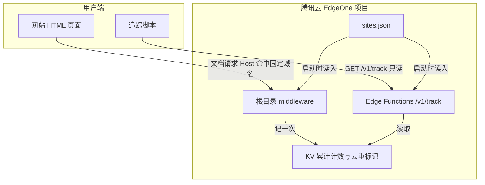

# 项目技术文档：Kestrel

> 一个基于腾讯云 EdgeOne 的轻量页面计数。HTML 文档请求到达本边缘且 Host 命中站点固定域名时，累计站点 PV、页面 PV、站点 UV、页面 UV。

## 1. 项目概述

**Kestrel** 在边缘累计四个整数，页面脚本只把它们读出来填回页面。站点和主机名白名单来自仓库里的 `sites.json`，加载模块时读入。

### 核心目标

- **轻量**：追踪脚本 gzip 后小于 5KB。
- **隐私**：不存原始事件、明文 IP、来源、地理或设备。
- **云原生**：Edge Functions + 项目根 middleware + KV，不需要应用服务器，也不使用 Blob。

### 产品范围

1. **页面计数**：根目录 `middleware.ts` 在文档请求上记一次访问。`edge-functions` 的文件路由拦截不到静态 HTML（与静态资源冲突时优先走静态文件），所以计数不放在 `/v1` 函数里。
2. **页面展示**：`GET /v1/track` 公开、只读，响应只有四个整数，绝不计数。
3. **站点名单**：`sites.json` 列出站点 id 和主机名白名单。没有站点管理接口。

`POST /v1/track` 保留为明确失败：405，`error` 为 `not_counted`，不读请求体，不增加 PV/UV。不再提供趋势、来源、地理、设备、IP、最近事件或在线人数。也不提供登录、控制台或 `/v1/stats/counts`。

## 2. 技术架构



1. 固定域名必须解析到本 EdgeOne 项目。浏览器打开该主机名下的 HTML 时，middleware 先执行，再 `next()` 继续到静态页面或函数。
2. 只处理 GET 的文档导航：`Sec-Fetch-Dest: document`，或者没有该头时 `Accept` 包含 `text/html`。响应需要是 200 且 `Content-Type` 含 `text/html`（304 也算）。静态资源、`kestrel.js`、`/v1/*`、预取、重定向都不计。
3. HTTP Host（没有 Host 头时用平台给出的请求 URL 主机名）与 `sites.json` 里站点的 `domain` 做精确匹配。命中后用这次请求自己的 pathname 加查询串作为页面身份。请求体里的 url 不参与。
4. 访客取 cookie `kestrel_vid`。没有或格式不合法时发一个新的（HttpOnly）。UV 去重键仍是 `seen_*`，但 id 只来自这个 cookie。
5. 脚本用 `GET /v1/track?siteId=&path=` 把四个数写入 `kestrel_value_*`，并把 `kestrel_container_*` 设为 `inline`。这次 GET 不计 PV。
6. 单页应用的 `pushState` 不会到达边缘，所以客户端路由不再单独计数。

只把脚本嵌到别的网站、页面不经过本项目时，文档请求到不了 middleware，PV/UV 不会增加。脚本仍能读数。

## 3. 技术栈

| 类别 | 选型 | 说明 |
| :--- | :--- | :--- |
| 边缘 | 项目根 `middleware.ts`；`edge-functions` 文件路由 | middleware 看全部请求；函数只服务 `GET/POST /v1/track` |
| 站点名单 | 仓库根目录 `sites.json` | 启动时解析，不写入 KV |
| 存储 | EdgeOne KV，绑定名 `kestrel_kv` | 只存四个计数和去重标记 |
| 埋点 | esbuild 打成 `kestrel.js` | 只读四个数 |

## 4. 数据模型

### 4.1 什么算一次访问

没有「上报事件」请求体。一次访问是到达本边缘的 HTML 文档请求：

- Host 命中某个站点的 `domain`（字符串数组，不含协议、路径和端口）。
- 比较忽略大小写，去掉末尾的点，端口不参与，精确匹配。不支持 `*.example.com`。`localhost` 与 `127.0.0.1` 可作为普通条目。
- 白名单为空，或 Host 不在任何名单里：不计数，也不发访客 cookie。
- 多个站点写了同一个主机名时，`sites.json` 里先出现的那个计数。
- 页面身份是这次请求 URL 的 pathname 加查询串，不含域名。

成功写入后，只读接口返回：

```json
{ "site_pv": 2, "page_pv": 2, "site_uv": 1, "page_uv": 1 }
```

`POST /v1/track` 不返回这四个数：

```json
{ "error": "not_counted", "message": "POST /v1/track 不会增加 PV/UV…" }
```

状态码 405。

### 4.2 站点文件

`sites.json`：

```json
{
  "sites": [
    { "id": "kestrel", "domain": ["kestrel.crzliang.cn"] },
    { "id": "www", "domain": ["www.crzliang.cn"] },
    { "id": "blog", "domain": ["blog.crzliang.cn"] }
  ]
}
```

`id` 为 `[A-Za-z0-9_]{2,64}`，读入时转为小写。`domain` 每项是裸主机名，最多 32 个；空数组合法，但该站点不会被任何 Host 命中。重复 id、通配符或带端口的主机名会使加载失败。

### 4.3 KV 键

键只能是数字、字母、下划线，所以页面路径先做 SHA-256 十六进制再写入。`put` 没有 TTL，也没有原子自增；同节点写完立刻可读，其他节点最长约 60 秒看到旧值。并发下少计可以接受。

| 用途 | Key | Value |
| :--- | :--- | :--- |
| 站点 PV | `spv_{siteId}` | 十进制字符串 |
| 站点 UV | `suv_{siteId}` | 十进制字符串 |
| 页面 PV | `ppv_{siteId}_{pathHash}` | 十进制字符串 |
| 页面 UV | `puv_{siteId}_{pathHash}` | 十进制字符串 |
| 站点访客已见 | `seen_{siteId}_{visitorId}` | `"1"` |
| 页面访客已见 | `seen_{siteId}_{pathHash}_{visitorId}` | `"1"` |

`visitorId` 来自 cookie `kestrel_vid`：去掉连字符后只能是 `[A-Za-z0-9_]{8,64}`。站点名单不进 KV。

UV 去重键会随访客增长，每个键只存一个字符。不把访客列表塞进同一个 JSON。

## 5. API

基础路径：`/v1/`

| 方法 | 路径 | 说明 |
| :--- | :--- | :--- |
| `GET` | `/track` | 公开，只读。Query：`siteId`，可选 `path`。四个整数；省略 `path` 时页面计数为 0。不计 PV |
| `POST` | `/track` | 公开，但不计数。405，`not_counted`。正文被忽略 |

`GET /track` 在站点不存在于 `sites.json` 时返回 `unknown_site`（404），`siteId` 缺失为 `siteId_required`（400），格式不对为 `invalid_payload`（400）。查询参数里的 `url` 不会被当成页面地址。空名单站点可以读取，数字保持 0，直到有文档请求命中它的主机名——空名单永远不会命中。

## 6. 目录

```text
kestrel/
├── middleware.ts
├── sites.json
├── edge-functions/v1/track.ts   # 只读 GET；POST 明确不计数
├── edge-functions/lib/counter.ts
├── edge-functions/lib/sites.ts  # 启动时解析 sites.json
├── edge-functions/lib/storage.ts
├── tracking-script/src/index.ts
└── docs/
```

## 7. 开发与部署

本地：

```bash
npm install
npm run build -w @kestrel/shared
npm run build:tracker
npm run dev
```

Mock API http://127.0.0.1:8088 。它和边缘共用 `sites.json`，对非 `/v1` 的 HTML 文档请求按 Host 计数。

生产在 EdgeOne Pages 绑定 KV 命名空间 `kestrel_kv`（变量名相同）。构建命令 `npm run build`，输出目录 `tracking-script/dist`（`index.html` 与 `kestrel.js`）。根目录 `middleware.ts` 随项目部署，默认匹配全部路由；`/` 的 HTML 在 Host 命中时照常计数。未绑定 KV 时函数使用进程内 Map，数据不持久。

## 8. 实现约束

细节与键的读写见 [追踪与存储](./TRACKING-AND-STORAGE.md)。

- KV `put` 无 TTL、无原子自增。计数是读改写，允许大约数。
- 键字符集只有 `[A-Za-z0-9_]`。站点 ID 不能带连字符；页面路径必须哈希；cookie 里的连字符会去掉。
- 不写 Blob，不保存原始访问日志。
- 脚本缓存：嵌入地址带 `?v=`，并让缓存键包含该参数。
- 边缘函数文件路由不能代替页面拦截。计数只存在于根 middleware 这条路径上。
